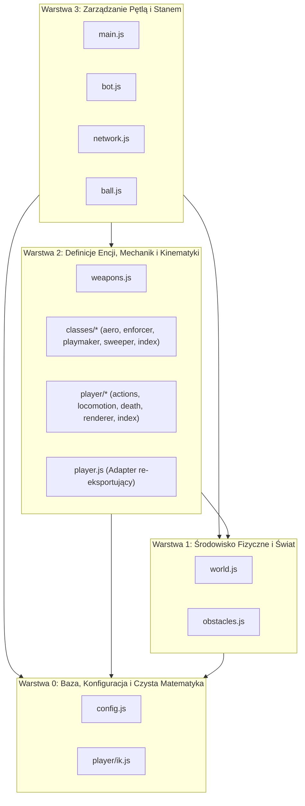

# AGENT.md — Reguły Architektoniczne i Graf Zależności (Strict DAG)

Niniejszy dokument stanowi bezwzględny, stały zbiór reguł architektonicznych dla projektu **Keep-it-high**. Wszystkie przyszłe zadania programistyczne, refaktoryzacje oraz implementacje nowych mechanik MUSZĄ ściśle przestrzegać poniższych wytycznych.

---

## 1. Architektura Warstwowa (Strict DAG — Zero Circular Dependencies)

Struktura kodu projektu opiera się na **jednokierunkowym grafie acyklicznym (DAG)** podzielonym na 4 ściśle zdefiniowane warstwy. Zależności mogą biec **wyłącznie w dół** (moduł z wyższej warstwy może importować moduły z warstw niższych, nigdy odwrotnie). Importy poziome w ramach tej samej warstwy są dopuszczalne wyłącznie tam, gdzie zostało to wyraźnie wskazane.



---

### Szczegółowa specyfikacja warstw

#### Warstwa 0 — Baza i Matematyka (Base & Pure Math)
* **Pliki**: `js/config.js`, `js/player/ik.js`
* **Zasady**:
  - Czyste funkcje matematyczne, stałe konfiguracyjne, parametry fizyki, geometria analityczna (np. solwer 2-Bone IK, interpolacje `lerp`, `ease`, `parabola`).
  - **ZERO importów domenowych**: pliki te nie importują absolutnie niczego z pozostałych modułów gry.
  - Brak jakichkolwiek zależności od stanu gry, DOM, Canvasu czy encji.

#### Warstwa 1 — Środowisko Fizyczne (Physical Environment & Canvas)
* **Pliki**: `js/world.js`, `js/obstacles.js`
* **Zasady**:
  - Zarządzają statyczną geometrią areny, kamerą, renderowaniem otoczenia, cząsteczkami, systemem krwi/gore oraz kolizjami segmentów.
  - Mogą importować **wyłącznie Warstwę 0** (oraz wewnątrz warstwy: `obstacles.js` importuje narzędzia z `world.js`).
  - **Rygorystyczny zakaz importu encji**: Warstwa 1 NIE MOŻE importować gracza (`player`), bota (`bot`), broni (`weapons.js`) ani piłki (`ball.js`).

#### Warstwa 2 — Definicje Encji i Mechanik (Entity Definitions & Mechanics)
* **Pliki**: `js/weapons.js`, `js/classes/*`, podmoduły `js/player/*` (`actions.js`, `locomotion.js`, `death.js`, `renderer.js`, `index.js`), `js/player.js` (adapter).
* **Zasady**:
  - Czyste definicje archetypów postaci, definicje balistyki i broni, algorytmy trajektorii kończyn, systemy póz IK oraz procedury renderowania modelu gracza.
  - Mogą importować **Warstwę 0 oraz Warstwę 1**.
  - Traktowane jako fabryki stanów, wzorce danych i procedury obliczeniowe operujące na przekazywanych parametrach.

#### Warstwa 3 — Zarządzanie Pętlą i Stanem (Game Loop, State & Orchestration)
* **Pliki**: `js/main.js`, `js/bot.js`, `js/network.js`, `js/ball.js`
* **Zasady**:
  - Inicjalizują instancje obiektów (`player`, `bot`, `remotePlayer`, `ball`).
  - Odpowiadają za pętlę gry (`requestAnimationFrame`), obsługę wejść (Input Manager: klawiatura, gamepad, mysz, dotyk), synchronizację sieciową (WebRTC/PeerJS) oraz orkiestrację logiki AI bota.
  - Mogą swobodnie importować moduły z Warstw 0, 1 i 2.

---

## 2. Zasada Wstrzykiwania Zależności (Dependency Injection)

Wszelkie obiekty stanu (`player`, `ball`, `bot`, `remotePlayer`) **NIGDY nie mogą być importowane do modułów Warstwy 1 ani Warstwy 2**.

Wszelkie interakcje fizyczne i operacje muszą opierać się na przekazywaniu instancji jako argumenty wywołania:

```javascript
// ❌ ŹLE (Warstwa 1 lub 2 importuje instancję stanu):
import { player } from './player.js'; // BŁĄD ARCHITEKTONICZNY! Pętla zależności!

export function checkGroundCollision() {
  if (player.y > 500) { ... }
}

// ✅ PRAWIDŁOWO (Dependency Injection - instancja wstrzykiwana jako parametr):
export function checkPlayerPlatformLanding(p, platforms) {
  if (p.y > 500) { ... }
}
```

### Korzyści:
1. Eliminacja sprzężeń zwrotnych (Zero Circular Dependencies).
2. Wielokrotne wykorzystanie kodu: ta sama funkcja fizyki, kolizji, animacji czy strzału obsługuje identycznie gracza lokalnego (`player`), przeciwnika AI (`bot`) oraz gracza sieciowego (`remotePlayer`).

---

## 3. Izolacja Modułów wewnątrz Folderu `player/`

Folder `js/player/` posiada ściśle zdefiniowaną hierarchię wewnętrzną:

```
js/
├── player.js           <-- WYŁĄCZNIE ADAPTER: re-eksportuje ./player/index.js
└── player/
    ├── ik.js           <-- Warstwa 0: czysta matematyka i solwery kości (0 importów)
    ├── locomotion.js   <-- Trajektorie stóp, chód, bieg, sprint, akrobatyka freestyle
    ├── actions.js      <-- Trajektorie kopnięć z ziemi, wyskoków, nożyc, backflipa
    ├── death.js        <-- Ragdoll, obrażenia śmiertelne, dekapitacja, gore
    ├── renderer.js     <-- Renderowanie IK, cieniowanie części ciała, broń
    └── index.js        <-- Główny moduł gracza: fabryka instancji, updatePlayer i re-eksporty
```

### Reguły wewnętrzne dla `player/`:
1. **Jednokierunkowy przepływ wewnątrz `player/`**:
   - `actions.js`, `locomotion.js`, `death.js`, `renderer.js` mogą importować z `./ik.js` oraz od siebie nawzajem (o ile nie tworzą lokalnej pętli).
   - **BEZWZGLĘDNY ZAKAZ**: Żaden podmoduł (`actions.js`, `renderer.js`, `death.js`, `locomotion.js`, `ik.js`) NIE MOŻE importować z `./index.js` ani z `../player.js`.
2. **Rola `player/index.js`**:
   - Pełni rolę koordynatora podmodułów: importuje je, implementuje `createPlayerInstance()` oraz `updatePlayer()`, a następnie re-eksportuje interfejs publiczny.
3. **Rola `js/player.js`**:
   - Pozostaje wyłącznie minimalistycznym adapterem zapewniającym kompatybilność wsteczną dla reszty silnika:
     ```javascript
     export * from './player/index.js';
     ```

---

## 4. Procedura Wdrażania Nowych Mechanik i Manewrów

Każdy nowy manewr (np. wślizg, nowy trik z piłką, fikołek, odskok, unik) musi być wdrażany według następującej procedury krok po kroku:

### Krok 1: Projekt Trajektorii i Póz (W izolacji)
- Obliczenia analityczne, krzywe Gaussa/parabole lub trajektorie stóp/rąk implementuj w `js/player/actions.js` lub `js/player/locomotion.js`.
- Funkcje powinny być czystymi funkcjami matematycznymi przyjmującymi postęp czasu `phase` (0..1) oraz parametry ciała:
  ```javascript
  // player/actions.js
  export function getCustomManeuverTargets(phase, facing, body) { ... }
  ```

### Krok 2: Zarządzanie Stanem i Fizyką
- W `js/player/index.js`:
  - Dodaj odpowiednie flagi i timery w stanie fabryki `createPlayerInstance()` (np. `p.customManeuverTimer = 0`, `p.isCustomManeuver = false`).
  - W funkcji `updatePlayer(p, ...)` obsłuż przejścia maszyny stanów, zmniejszanie timerów i modyfikację wektorów prędkości (`p.vx`, `p.vy`).

### Krok 3: Warstwa Wizualna i Renderowanie
- W `js/player/renderer.js`:
  - Pobierz obliczone cele z `actions.js` lub `locomotion.js`.
  - Przepuść je przez solwer `solve2BoneIK` z `ik.js`.
  - Wyrenderuj odpowiednie ułożenie kończyn lub tułowia.

### Krok 4: Weryfikacja Braku Pętli Zależności (Sanity Check DAG)
Przed zakończeniem zadania upewnij się, że:
1. Żaden z modyfikowanych podmodułów nie zaimportował `index.js`.
2. Warstwa 1 i Warstwa 2 nie zaimportowały obiektów stanu z Warstwy 3.
3. W konsoli przeglądarki nie występuje błąd: `Uncaught ReferenceError: Cannot access '...' before initialization` (typowy objaw pętli w modułach ES6).

---

## 5. Podsumowanie — Ściąga Architektoniczna

| Warstwa | Pliki | Co może importować? | Czego NIE MOŻE importować? |
| :--- | :--- | :--- | :--- |
| **0: Baza & Math** | `config.js`, `player/ik.js` | *Nic* (0 importów) | Wszystkiego |
| **1: Świat & Fizyka** | `world.js`, `obstacles.js` | Warstwa 0 | Gracza, bota, piłki, broni |
| **2: Encje & Mechaniki** | `weapons.js`, `classes/*`, `player/*` | Warstwa 0, Warstwa 1 | Obiektów stanu (`player`, `ball`, `bot`) z Warstwy 3 |
| **3: Pętla & Stan** | `main.js`, `bot.js`, `network.js`, `ball.js` | Warstwa 0, 1, 2, 3 | — |
